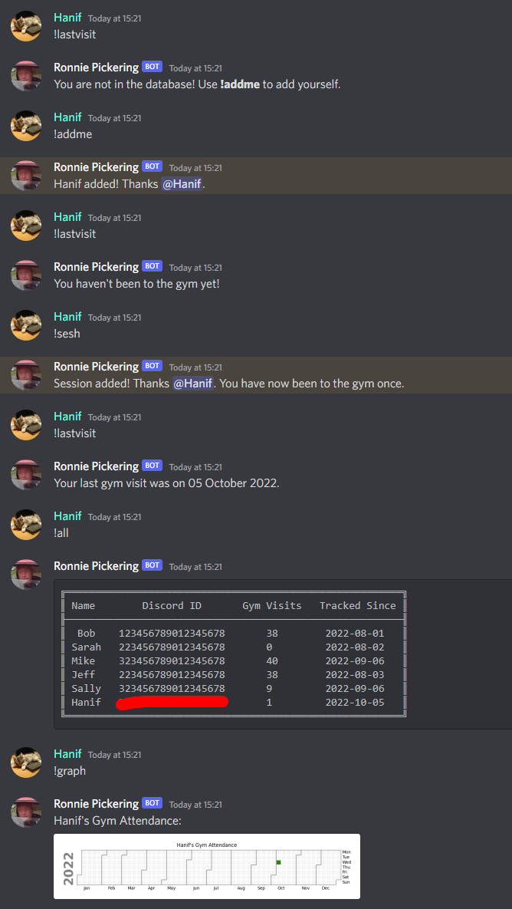
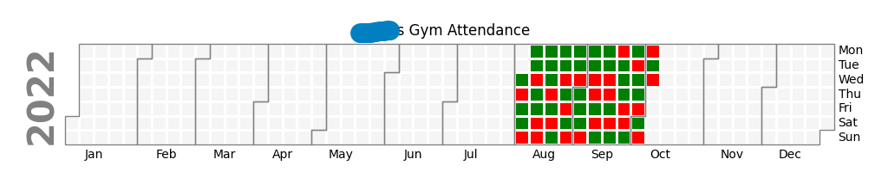

# discord-gym-bot
A Discord bot for tracking and displaying gym visits in a server.
Ideal if you want to easily keep track of your gym progress, and motivate both yourself and others.

## List of commands

**!addme** -- adds yourself to the database

**!sesh** -- record a gym session for yourself in the database

**!all** -- displays all user data

**!graph** -- show your gym attendance on a calendar

**!graph @person** -- show the specified person's gym attendance on a calendar

**!lookup** -- look up how many times you have been to the gym

**!lookup @person** -- look up how many times the specified person has gone to the gym

**!lastvisit** -- look up when you last went to the gym

**!lastvisit @person** -- look up the specified person's last visit to the gym

## Example of command usage

## Example of a !graph plot, showing full gym attendance for a user

